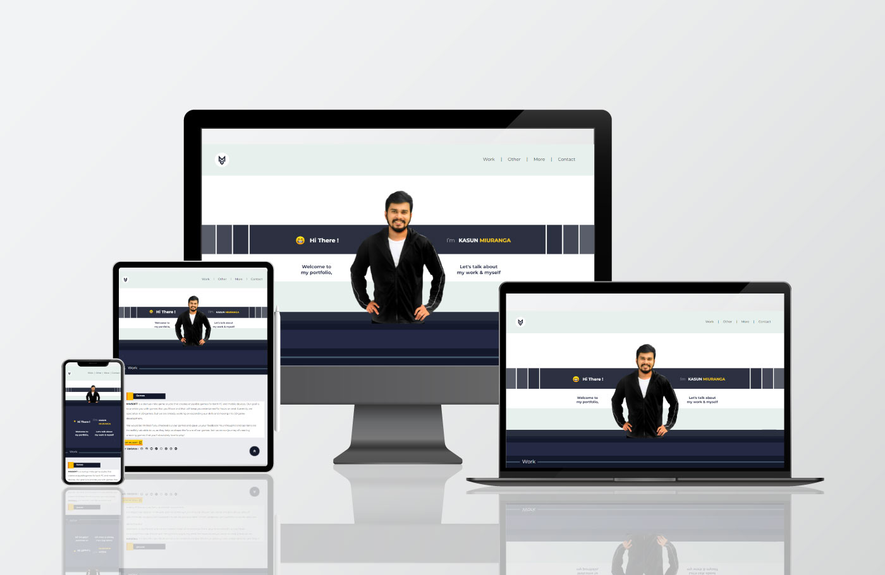

<h3>Technology & Frameworks</h3>

<ul>
  <li>HTML</li>
  <li>CSS</li>
  <li>JS</li>
  <li>Bootstrap</li>
  <li>Jquery</li>
</ul>
<h3>References</h3>

SiteMap🔗
https://drive.google.com/file/d/1vVPk6WNcYLmNzG8eEk9ZwdtKec5lOCOe/view?usp=sharing

WireFrame🔗
https://drive.google.com/file/d/1qksbFg5Sr-n6fZDtJ93hmb3I0uWxqx28/view?usp=sharing

Mockup🔗
https://www.figma.com/file/hAiPGJkGndXCVvJ6fHRwz4/Mockup?node-id=0%3A1&t=EFYaVEloQIvOJIU1-1

<h3>Deployment</h3>
InfinityFree : http://kasunmiuranga.epizy.com  
GitHub Pages : https://themiu.github.io/MyPortfolio/  

 
 
Desktop View | Tablet View | Mobile View

<h3> Web POS Using CSS FrameWorks</h3>

Sitemap & wireframe🔗
https://drive.google.com/file/d/1eWEmaahjJgHWX5uiR81lzvBYDUFOnlwf/view?usp=sharing

Mockup🔗
https://www.figma.com/file/5lNrfsDPFLnVMp1OZswxKS/POS-System-Wireframe?type=design&node-id=1%3A213&t=Rekh8tgFb704g7wZ-1

